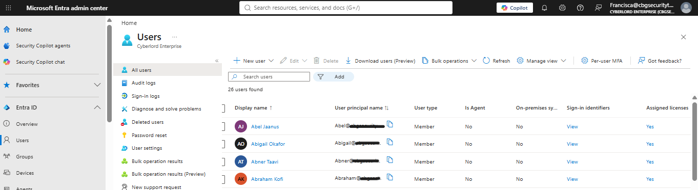
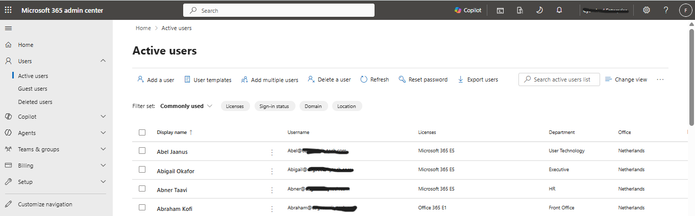
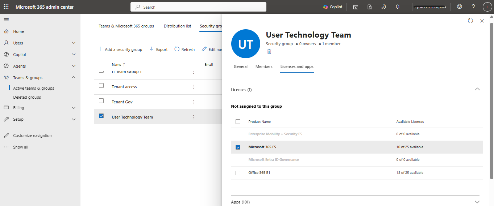
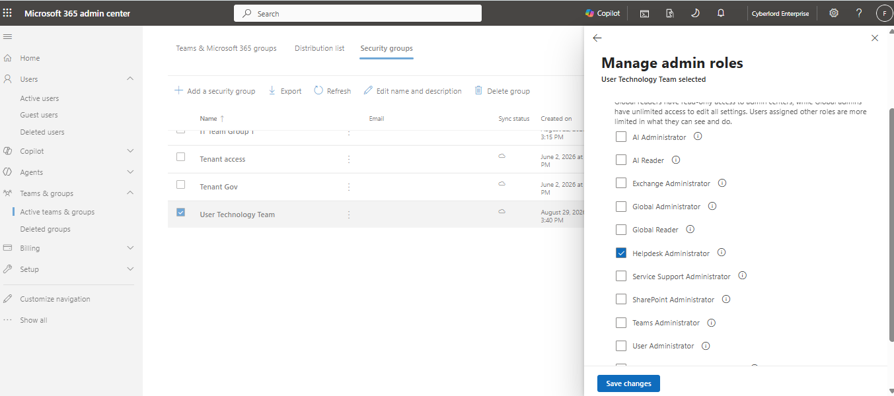
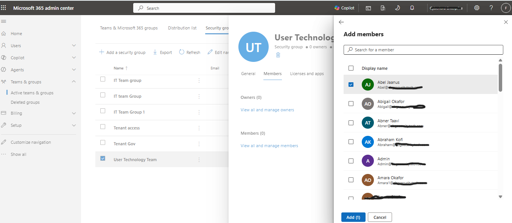

# Identity & Access Management Lifecycle Lab — Microsoft Entra ID

**A hands-on IAM project simulating the full employee identity lifecycle — provisioning, authentication, governance, and deprovisioning — for a fictional company, NorthWind Dynamics, using Microsoft Entra ID.**

---

## Table of Contents

- [Overview](#overview)
- [Skills Demonstrated](#skills-demonstrated)
- [Environment](#environment)
- [Scenario](#scenario)
- [1. Provisioning: New Hires](#1-provisioning-new-hires)
- [2. Group-Based Access](#2-group-based-access)
- [3. Just-in-Time Privileged Access (PIM)](#3-just-in-time-privileged-access-pim)
- [4. Authentication: SSO & the OAuth 2.0 Authorization Code Flow](#4-authentication-sso--the-oauth-20-authorization-code-flow)
- [5. Least-Privilege Admin Roles](#5-least-privilege-admin-roles)
- [6. Multi-Factor Authentication](#6-multi-factor-authentication)
- [7. Access Reviews](#7-access-reviews)
- [8. Conditional Access Hardening](#8-conditional-access-hardening)
- [9. Movers: Mid-Lifecycle Role Change](#9-movers-mid-lifecycle-role-change)
- [10. Leavers: Offboarding & the Cost of Deprovisioning Delay](#10-leavers-offboarding--the-cost-of-deprovisioning-delay)
- [11. Over-Permissioned Service Account](#11-over-permissioned-service-account)
- [Key Concepts Reference](#key-concepts-reference)
- [Takeaways](#takeaways)

---

## Overview

Real IAM work is a **lifecycle**: people join, their roles change, they leave — and every one of those transitions is an opportunity for either good security hygiene or an audit finding. This project walks through that full lifecycle inside Microsoft Entra ID, including the two scenarios that show up most often in real security audits: **permission creep from role changes**, and **deprovisioning delay after termination**.

## Skills Demonstrated

- User provisioning and attribute management in Microsoft Entra ID
- Group-based access management and dynamic group rules
- OAuth 2.0 / OpenID Connect authentication flow (Authorization Code flow)
- Role-Based Access Control (RBAC) and least-privilege role assignment
- Privileged Identity Management (PIM) — just-in-time admin access
- Conditional Access policy design, including break-glass account handling
- Access reviews and periodic governance
- Joiner-Mover-Leaver (JML) lifecycle management
- Service account / non-human identity risk remediation
- Security audit thinking — identifying and documenting real-world findings

## Environment

- Microsoft 365 Developer tenant (free — [developer.microsoft.com/microsoft-365/dev-program](https://developer.microsoft.com/microsoft-365/dev-program))
- Microsoft Entra admin center
- jwt.ms (Microsoft's token decoding tool) for inspecting OAuth tokens

## Scenario

NorthWind Dynamics is onboarding four new employees this week. As the IAM analyst, I'm responsible for provisioning their access correctly from day one, then carrying that responsibility through role changes, offboarding, and cleanup of risky non-human accounts.

| Employee       | Job Title    | License              | Security Group       | Admin Role                    |
|----------------|--------------|----------------------|----------------------|-------------------------------|
| Abigail Okafor | CEO          | Microsoft 365 E5     | Executives           | None                          |
| Abraham Kofi   | Receptionist | Office 365 E1        | Receptionist Team    | None                          |
| Abel Jaanus    | IT Support   | Microsoft 365 E5     | IT                   | Helpdesk Admin                |
| Abner Taavi    | HR Manager   | Microsoft 365 E5     | HR Group             | None                          |

**Design principle:**  RBAC is applied such that admin rights match actual job need — not seniority. The HR Manager — despite being the most senior person on the Human Resource (HR) team — gets **no** admin role. Seniority is not the same as system control. Only IT Support gets the Help Desk Admin role and for **some** more elevated access, only temporarily, via PIM.

---

## 1. Provisioning: New Hires

Created four user accounts in the Entra admin center with consistent naming, correct job titles/departments, and appropriate license assignment (E5 for full toolset roles, E1 for the receptionist role where a lighter license was sufficient).

> Users list in Entra admin center showing all four accounts.
> 
>
>
> Users list in Microsoft 365 admin center showing all four accounts, licensed and active.
>
> 

---

## 2. Group-Based Access

Rather than assigning access per-user, I used **two different group types** in Entra ID, chosen deliberately based on what each was actually for:

- **Security Group** — used purely for access control: license assignment, and (for IT) admin role eligibility.
- **Microsoft 365 Group** — for a shared collaboration space: a shared inbox, shared calendar, and a private Teams space for the team to work from.

**Security Group**

I created four security groups (`Executives`, `Receptionist Team`, `Human Resource Team`, `User Technology Team`) and added each relevant employee as members, to the group matching their function.

For example: - I created a **security group** for the `Human Resource Team` 
- Assigned the license (Office 365 E1) to the team because the embedded applications are required for members of the team to carry out their duties.
- Added **Abner Taavi** (HR Manager) to the`Human Resource Team` 

See screenshot showing how the security grouping appears for **Human Resource Team**.

> 
> 
> 
> 

>

I created a **security group** for the `User Technology Team` 
- Assigned the license (Microsoft 365 E5) to the team because the embedded applications are required for members of the team to carry out their duties.
- Under the Admin center access, I assigned the **Helpdesk Administrator** role to the `User Technology Team`  because members will perform password change activities for users. 'explain why Global Administrator would be excessive for the IT Support role'
- Added **Abel Jaanus** (IT Support) as a member to the `User Technology Team`

See screenshot showing how the security grouping appears for **User Technology Team**.

> 
>
> 
>
> 

**Microsoft 365 Group**

I created a Microsoft 365 group for **Human Resource Team**

I deliberately used both security and Microsoft 365 group types for **Human Resource Team** because the team had two distinct needs that don't overlap: **license/access governance** (handled by the Security Group) and **team collaboration** (handled by the Microsoft 365 Group). 

Note: The Microsoft 365 group can be used for all teams if required — for team shared collaborations, a shared inbox, shared calendar, and a private Teams space for the team to work from.

See screenshot showing how it looks on the platform. 

>
>
>>

## 3-Just-in-time-privileged-access-pim
 
Practice "how would you handle" scenarios: a user like hr manager and IT support needs elevated access temporarily through PIM  Part F — Just-in-Time Privileged Access (PIM)

NEXT
Jml

NEXT
conditional access
